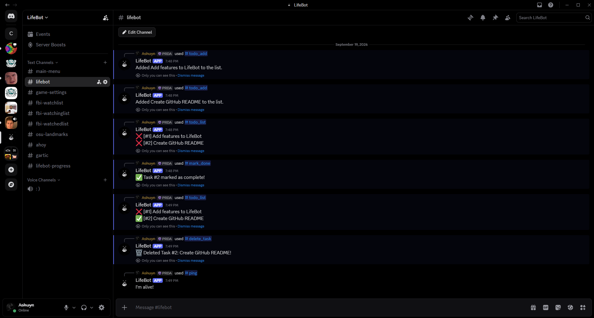

# LifeBot

A Discord bot for creating and managing a personal to-do list, with persistent storage.



## Features

- `/todo_add` - Add a task to your list
- `/todo_list` - Show all of your tasks with their IDs and completion status
- `/mark_done` - Mark a task as completed by its ID
- `/delete_task` - Delete a task from the list by its ID
- `/ping` - Health check to confirm the bot is online
- `/remind` — Set a reminder (`/remind message:take a break time:30m`); the bot DMs you when time is up

All replies are ephemeral(only the user who ran the command sees them).

## Tech Stack

- **Python 3.14** - main language
- **discord.py 2.7** - Discord API wrapper and slash command framework
- **aiosqlite 0.22** - async SQLite driver for database access
- **SQLite** - local database storage (single file, no server required)
- **python-dotenv** - loads secrets from a `.env` file

## Setup

1. **Clone the repo:**

    ```
    git clone https://github.com/ethvan/lifebot.git
    cd lifebot
    ```

2. **Create and activate a virtual environment:**

    ```
    python -m venv venv
    venv\Scripts\activate.bat
    ```

3. **Install dependencies:**

    ```
    pip install -r requirements.txt
    ```

4. **Create a `.env` file** in the project root with your Discord bot token:

    ```
    DISCORD_TOKEN=your_token_here
    ```

    To get a token:

    - Go to https://discord.com/developers/applications
    - Create a new application, then a bot
    - Copy the token from the Bot tab
    - Invite the bot to a server using the OAuth2 URL Generator (scopes: `bot`, `applications.commands`; permissions: `Send Messages`, `Read Message History`)

5. **Run the bot:**

    ```
    python bot.py
    ```

    You should see `LifeBot#8795 online...`. Then type `/todo_add` in Discord to test.

## Future Improvements

✅ Add a `/remind` command with background scheduling using `discord.ext.tasks`
- Add habit tracking with daily streaks
- Migrate slash command names to command groups so `/todo add` uses a space instead of an underscore
✅ Deploy to Railway for 24/7 uptime
- Add tests for the database layer

## License

MIT — see [LICENSE](LICENSE) for details.
